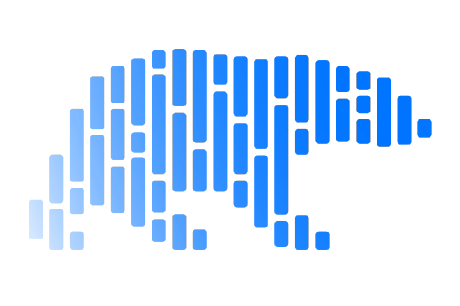
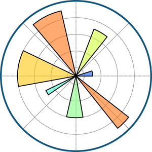
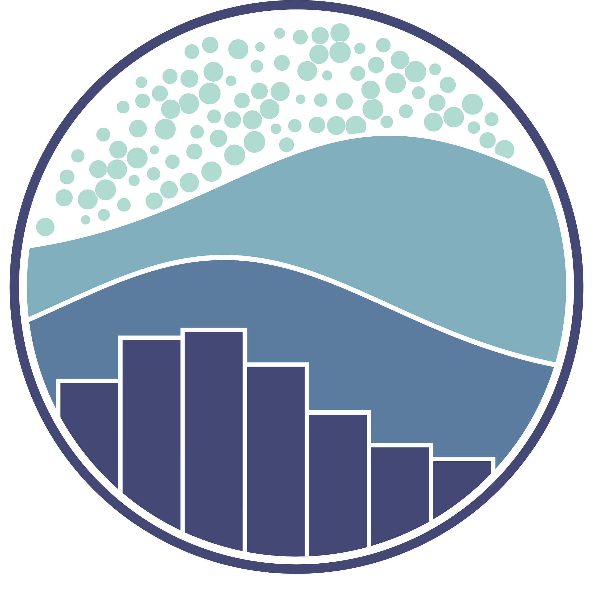

<h1 align="center">Hi 👋, I'm Fahad Pathan</h1>
<h3 align="center">Passionate Software Engineering Student</h3>

  

- 🌱 I’m currently learning **Django**

- 📫 How to reach me **fahadpathan56@gmail.com**

<h2 align="left">Connect with me:</h2>

 

<h2 align="left">Programming Profiles:</h2>

<h2 align="left">Familiar With:</h2>

  
💻 Competitive Programming

  
  

  
📱 Android Development

  
  

  
🌐 Frontend Development

  
  
  
  <!-- add bootstrap -->
  
  
  

  
💻 Backend Development

  
  
  
  
  

  
📊 Database

  
  
  
  

  
🤖 Machine Learning

  
  
  
  
  
  
  
  
  

  
🔧 Version Control

  
  

  
🛠️ Tools

  
  
  

<h1 align="center"><b><i>Github Stats</i></b> </h1>

<!--  -->

<h1 align="center"><b><i>WakaTime Stats from 27-07-23</i></b> </h1>

<h1 align="center"><b><i>Contribution Stack</i></b> </h1>

 

